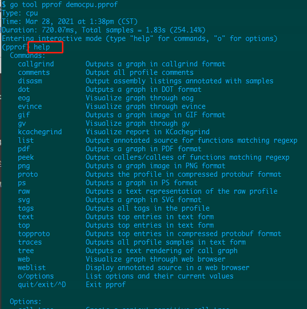

## golang 程序性能调优

### 在 golang 程序中，有哪些内容需要调试优化？

一般常规内容：

- cpu：程序对cpu的使用情况 - 使用时长，占比等
- 内存：程序对cpu的使用情况 - 使用时长，占比，内存泄露等。如果在往里分，程序堆、栈使用情况
- I/O：IO的使用情况 - 哪个程序IO占用时间比较长

golang 程序中：

- goroutine：go的协程使用情况，调用链的情况
- goroutine leak：goroutine泄露检查
- go dead lock：死锁的检测分析
- data race detector：数据竞争分析，其实也与死锁分析有关

### 有什么方法工具调试优化 golang 程序

比如 linux 中 cpu 性能调试，工具有 top，dstat，perf 等。

那么在 golang 中，有哪些分析方法？

golang 性能调试优化方法：

> Benchmark：基准测试，对特定代码的运行时间和内存信息等进行测试
Profiling：程序分析，程序的运行画像，在程序执行期间，通过采样收集的数据对程序进行分析
Trace：跟踪，在程序执行期间，通过采集发生的事件数据对程序进行分析
profiling 和 trace 有啥区别？
profiling 分析没有时间线，trace 分析有时间线。

在 golang 中，应用方法的工具呢？

这里介绍 pprof 这个 golang 工具，它可以帮助我们调试优化程序。

>它的最原始程序是 gperftools - <https://github.com/gperftools/gperftools，golang> 的 pprof 是从它而来的。

### pprof 介绍

pprof 是 golang 的性能分析工具，它可以帮助我们分析程序的性能，找出性能瓶颈，优化程序。

本文将对下面 golang 中 2 个监控性能的包 pprof 进行运用：

- runtime/pprof：采集程序运行数据进行性能分析，一般用于后台工具型应用，这种应用运行一段时间就结束。

- net/http/pprof：对 runtime/pprof 的二次封装，一般是服务型应用。比如 web server ，它一直运行。这个包对提供的 http 服务进行数据采集分析。

上面的 pprof 开启后，每隔一段时间就会采集当前程序的堆栈信息，获取函数的 cpu、内存等使用情况。通过对采样的数据进行分析，形成一个数据分析报告。

pprof 以 profile.proto 的格式保存数据，然后根据这个数据可以生成可视化的分析报告，支持文本形式和图形形式报告。
profile.proto 里具体的数据格式是 protocol buffers。

那用什么方法来对数据进行分析，从而形成文本或图形报告？

用一个命令行工具 `go tool pprof`

### pprof 使用模式

- Report generation：报告生成
- Interactive terminal use：交互式终端
- Web interface：Web 界面

### runtime/pprof

调试分析 golang 程序，要开启 profile 然后开始采样数据。
然后安装：`go get github.com/google/pprof`,后面分析会用到。

采样数据的方式：

- 第 1 种，在 go 程序中添加如下代码：

[StartCPUProfile](https://pkg.go.dev/runtime/pprof#StartCPUProfile) 为当前 process 开启 CPU profiling 。
[StopCPUProfile](https://pkg.go.dev/runtime/pprof#StopCPUProfile) 停止当前的 CPU profile。当所有的 profile 写完了后它才返回。

```go
// 开启 cpu 采集分析：
pprof.StartCPUProfile(w io.Writer)

// 停止 cpu 采集分析：
pprof.StopCPUProfile()
```

[WriteHeapProfile](https://pkg.go.dev/runtime/pprof#WriteHeapProfile) 把内存 heap 相关的内容写入到文件中

```go
pprof.WriteHeapProfile(w io.Writer)
```

- 第 2 种，在 benchmark 测试的时候

```go
go test -cpuprofile cpu.prof -memprofile mem.prof -bench .
```

还有就是对 web 服务（http server） 数据的采集

```sh
go tool pprof $host/debug/pprof/profile
```

或者

```sh
go tool pprof -http=:9999 $host/debug/pprof/profile?seconds=30
```

### 案例

在程序中添加分析代码，demo.go

```go
package main

import (
 "bytes"
 "flag"
 "log"
 "math/rand"
 "os"
 "runtime"
 "runtime/pprof"
 "sync"
)

var cpuprofile = flag.String("cpuprofile", "", "write cpu profile to `file`")
var memprofile = flag.String("memprofile", "", "write mem profile to `file`")

func main() {
 flag.Parse()
 if *cpuprofile != "" {
  f, err := os.Create(*cpuprofile)
  if err != nil {
   log.Fatal("could not create CPU profile: ", err)
  }
  defer f.Close()

  if err := pprof.StartCPUProfile(f); err != nil {
   log.Fatal("could not start CPU profile: ", err)
  }
  defer pprof.StopCPUProfile()
 }

 var wg sync.WaitGroup
 wg.Add(200)

 for i := 0; i < 200; i++ {
  go cyclenum(30000, &wg)
 }

 writeBytes()

 wg.Wait()

 if *memprofile != "" {
  f, err := os.Create(*memprofile)
  if err != nil {
   log.Fatal("could not create memory profile: ", err)
  }
  defer f.Close()
  runtime.GC()

  if err := pprof.WriteHeapProfile(f); err != nil {
   log.Fatal("cound not write memory profile: ", err)
  }
 }
}

func cyclenum(num int, wg *sync.WaitGroup) {
 slice := make([]int, 0)
 for i := 0; i < num; i++ {
  for j := 0; j < num; j++ {
   j = i + j
   slice = append(slice, j)
  }
 }
 wg.Done()
}

func writeBytes() *bytes.Buffer {
 var buff bytes.Buffer

 for i := 0; i < 30000; i++ {
  buff.Write([]byte{'0' + byte(rand.Intn(10))})
 }
 return &buff
}

```

编译程序、采集数据、分析程序：

1. 编译 demo.go

```sh
go build -o demo demo.go
```

2. 用 pprof 采集数据，命令如下：

```sh
./demo.exe --cpuprofile=democpu.pprof  --memprofile=demomem.pprof
```

3. 分析数据

```sh
go tool pprof democpu.pprof
```

go tool pprof 简单的使用格式为：go tool pprof [binary] [source]

- binary： 是应用的二进制文件，用来解析各种符号
- source： 表示 profile 数据的来源，可以是本地的文件，也可以是 http 地址

> 要了解 go tool pprof 更多命令使用方法，请查看文档：go tool pprof --help

注意：
>获取的 Profiling 数据是动态获取的，如果想要获取有效的数据，需要保证应用或服务处于较大的负载中，比如正在运行工作中的服务，或者通过其他工具模拟访问压力。
否则如果应用处于空闲状态，比如 http 服务处于空闲状态，得到的结果可能没有任何意义。
（后面会遇到这种问题，http 的 web 服务处于空闲状态，采集显示的数据为空）

分析数据，基本的模式有 2 种：

- 一个是命令行交互分析模式
- 一个是图形可视化分析模式

## 命令行交互分析

A：命令行交互分析

分析上面采集的数据，命令：` go tool pprof democpu.pprof`

go tool pprof 会自动打开一个交互式命令行界面，界面如下：


|字段|说明|
|---|---|
|Type|表示当前分析的数据类型，比如 cpu 或者 mem|
|Time|表示当前分析的数据的采集时间|
|Duration| 采集数据持续的时间 |

Duration 下面还有一行提示，这是交互模式（通过输入 help 获取帮助信息，输入 o 获取选项信息）。

可以看出，go 的 pprof 操作还有很多其他命令。

输入 help 命令，出来很多帮助信息



## 参考:

[返回主页九卷技术录--关注技术，产品，管理]https://www.cnblogs.com/jiujuan/p/14588185.html
[http 压测工具 hey](https://github.com/rakyll/hey)