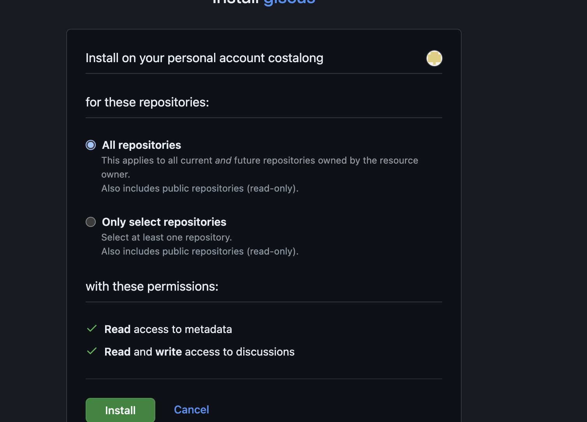
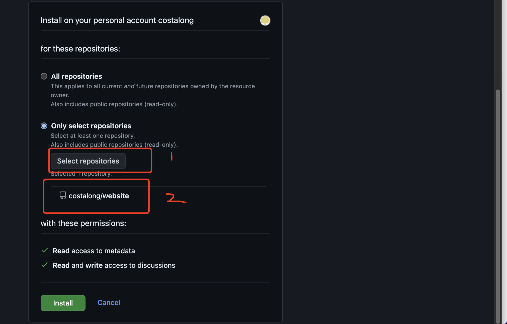

## 使用 github 安装 giscus

安装地址：  [giscus 安装地址](https://github.com/apps/giscus/installations/new)

选择使用项目

开启 Discussions 功能

* 点击项目 Setting 功能
* 
* 往下滑动到 Features 部分，找到 Discussions 多选择，把复选框选中 

* 获取项目的分类与分类id
  [点击进入](https://giscus.app/zh-CN) 滑动“仓库”位置，输入你开启的discussion 的仓库信息
  
## 参考我文档

[官方地址](https://giscus.app/zh-CN)
